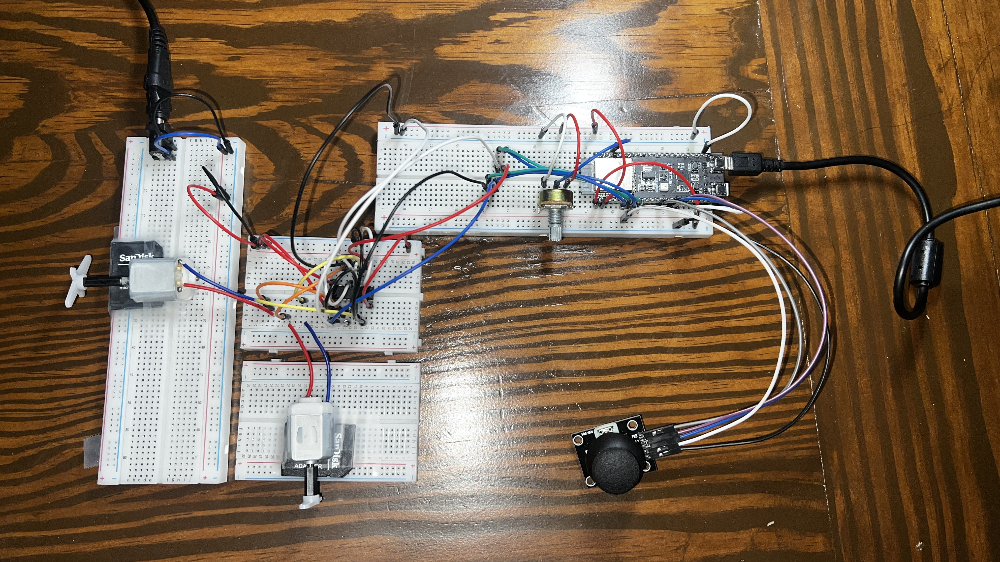
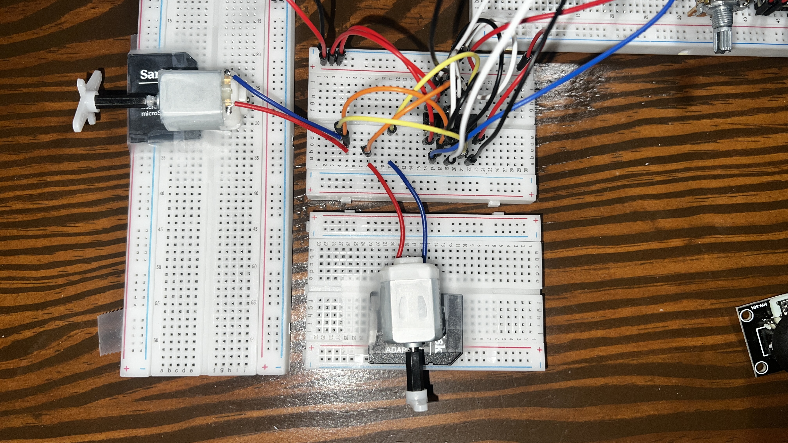
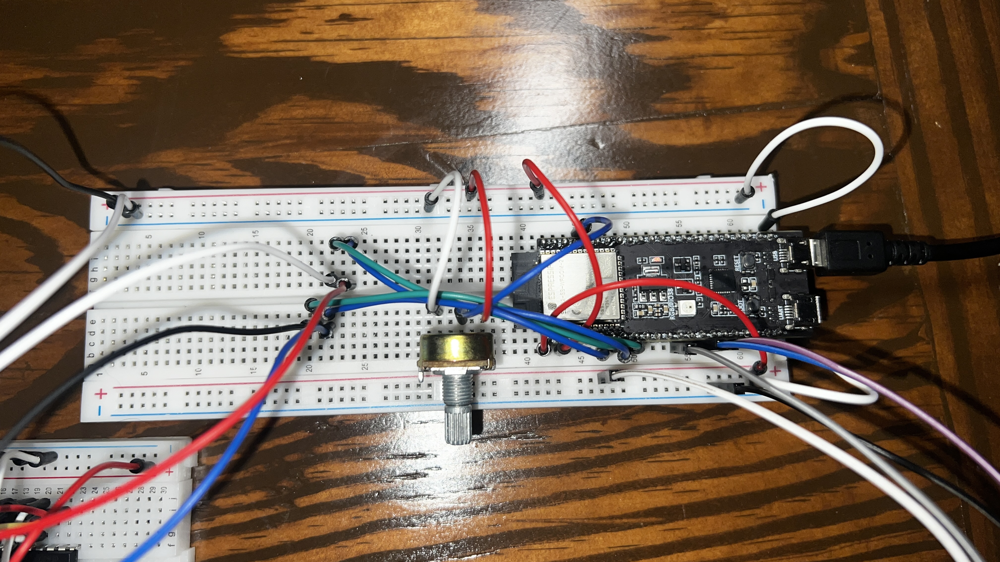
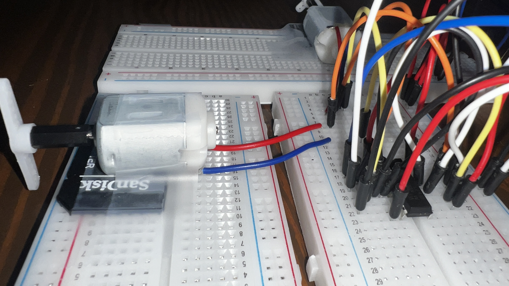
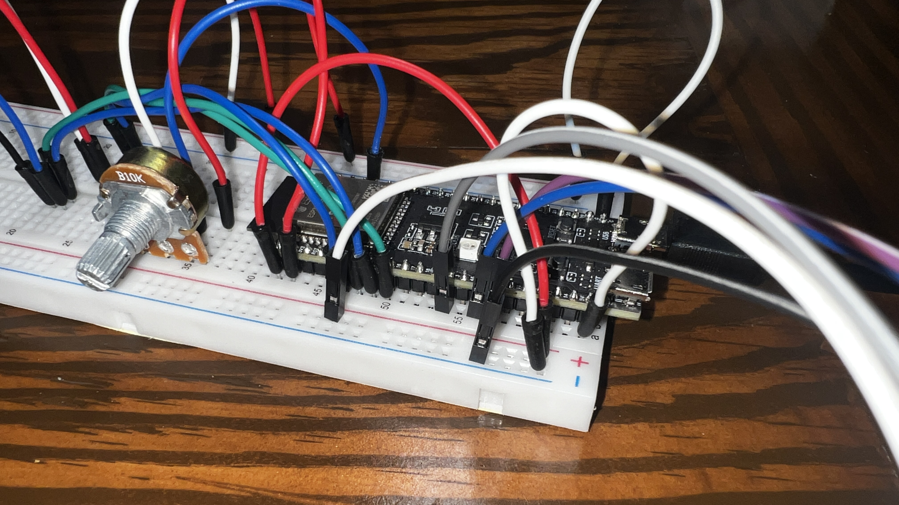
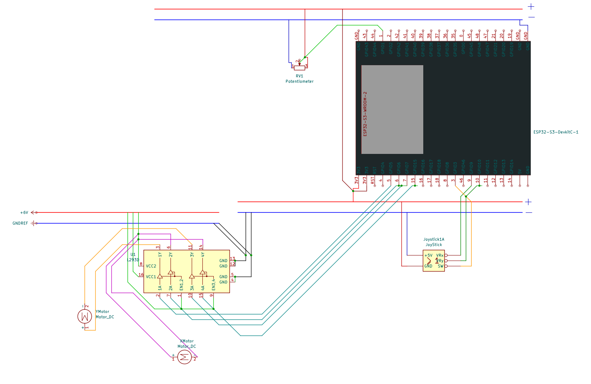

# ESP32-S3 Dual Motor Controller

## Overview

This project details how I used my ESP32 to control two DC motors with a potentiometer and a joystick.

This project familiarizes with electrical components such as wiring and power supplies, 
PWM, and the Arduino IDE. 

This setup can be applied to robotics and anything would need to move along 2d plane. 

# Modules

- ESP32-S3-WROOM-2
- L293D Motor Controller
- Potentiometer
- Joystick
- 2x DC Motors

    
    

## ESP32-S3-WROOM-2

My ESP32 took analog inputs from the potentiometer and joystick. It then converted those signals
to PWM for the DC motors. The ESP32 was powered via a USB cable while the DC Motors and the 
L293D were powered via a 6V power supply.

## L293D Motor Controller

The L293D received power from the power supply in order to power the DC motors. It also received 
power from the ESP32 in the form of PWM. Thus, it is also connected the ESP32s GND line.

    
    

## Schematic

The L293D received power from both the ESP32 and the power supply. Thus, it was connected to both
of their ground lines. The DC Motors received power from the power supply via the L293D. The
ESP32 received power from a usb cable connected to a PC.

