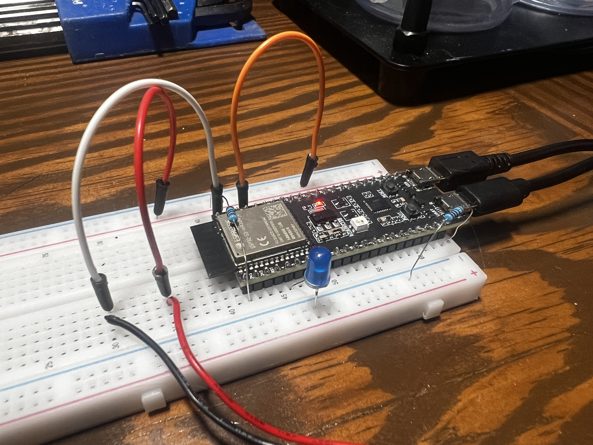
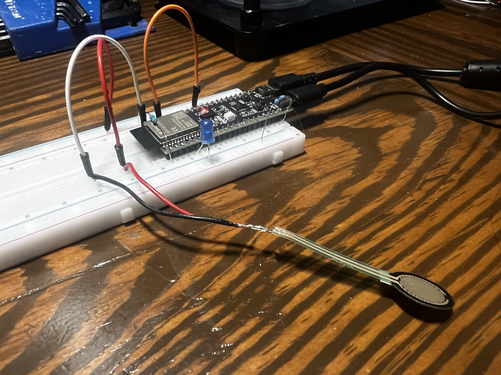
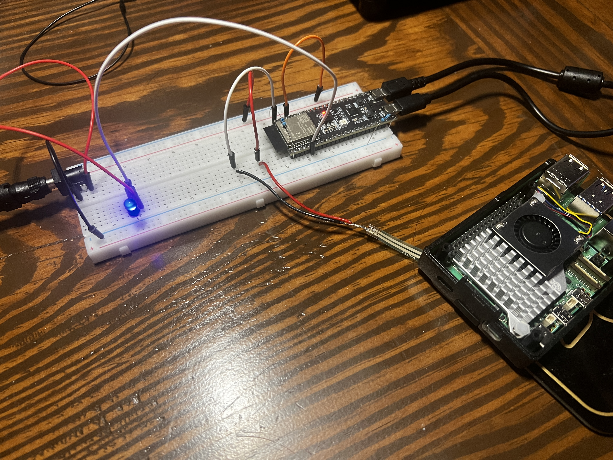

# Force Based Applications
___
## Overview

This project details how I used my ESP32-S3 to control other devices using a force resistor.

This project familiarizes with electrical components such as wiring and power supplies, analog reading and the Arduino IDE.

This setup is applicable to situations where placing an object in a particular place causes a reaction.

    
    

*Forced based application using a simple LED*

## Modules

- ESP32-S3-WROOM-2
- Simple Blue LED
- A Force Sensitive Resistor (FSR)

## ESP32-S3-WROOM-2

For the simple LED application above, the ESP32 powered the complete project. 
The 3v3 pin connects to the positive power rail which connects to the FSR pin as defined in the .ino
file and the FSR itself. It also provides a ground through the ground rail.

## Force Sensitive Resistor (FSR)

The FSR only has 2 wires. I soldered on a wire extension I stripped and cut to length for ease-of-use.
The FSR connects to the positive power rail and the ground power rail.

## LED

The LED as shown in this setup, it connected to the ESP32 via the transistor pin as defined in 
the .ino file. I defined it as transistorPin because this exact setup can be slightly modified to
implement a transistor and control components that would require a higher voltage.

___

## Modified Application

As mentioned in the LED section, this setup can be modified to implement a transistor and external power supply.
Utilizing this setup allows the ESP32 to control components that would require more volts than the
ESP32 can output.

    
    

*Force based application utilizing an external power supply and transistor*